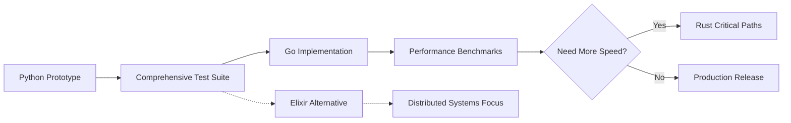

# Glang Implementation Language Comparison
*Created: 2025-01-08*

## Executive Summary
Evaluating implementation languages for production Glang: Python (current prototype), Elixir, Rust, and Go as candidates for the production implementation.

**Key Question:** Which language best supports building a graph-native programming language with high performance, good concurrency, and maintainable codebase?

---

## 🐍 Python (Current Prototype)

### Pros
- **Rapid Prototyping** ✅ Already proven
- **Rich Ecosystem**: Excellent parsing libraries (PLY, Lark, ANTLR)
- **Graph Libraries**: NetworkX, igraph for reference implementations
- **Easy AST Manipulation**: Native support for tree structures
- **Developer Productivity**: Fast iteration, readable code
- **Scientific Stack**: NumPy/SciPy for mathematical operations

### Cons
- **Performance** ❌ Global Interpreter Lock (GIL) kills parallelism
- **Speed**: 10-100x slower than compiled languages
- **Memory Usage**: High overhead per object
- **Distribution**: Requires Python runtime
- **Type Safety**: Dynamic typing makes compiler harder to debug

### Production Viability
```python
# Performance ceiling example
def traverse_graph(graph, start):
    # Python's GIL prevents true parallel graph traversal
    # Even with multiprocessing, overhead is significant
    visited = set()
    queue = [start]
    # Single-threaded bottleneck for large graphs
```

**Verdict:** Good for prototype, NOT suitable for production. Performance ceiling too low for serious graph processing.

---

## 💧 Elixir (BEAM VM)

### Pros
- **Actor Model** 🎯 Perfect for graph nodes as actors!
- **Fault Tolerance**: Supervision trees for robust compiler
- **Concurrency**: Millions of lightweight processes
- **Pattern Matching**: Excellent for AST manipulation
- **Hot Code Swapping**: Update compiler without restart
- **Functional**: Immutable data structures match graph philosophy

### Cons
- **Performance**: Not as fast as native compiled code
- **Ecosystem**: Smaller community, fewer parsing libraries
- **Learning Curve**: Functional paradigm different from prototype
- **Binary Size**: BEAM VM adds overhead
- **Number Crunching**: Not optimized for mathematical operations

### Unique Advantages for Glang
```elixir
# Each graph node could be an Erlang process!
defmodule GraphNode do
  def start_link(value, edges) do
    GenServer.start_link(__MODULE__, {value, edges})
  end
  
  # Natural message passing between nodes
  def propagate(node, message) do
    GenServer.cast(node, {:propagate, message})
  end
end

# Parallel graph operations for free!
nodes = Enum.map(graph.nodes, fn node ->
  Task.async(fn -> process_node(node) end)
end)
results = Task.await_many(nodes)
```

**Verdict:** EXCELLENT for distributed graph processing. Natural fit for graph-as-actors model. Could enable unique parallel graph features.

---

## 🦀 Rust

### Pros
- **Performance** 🚀 Zero-cost abstractions, no GC pauses
- **Memory Safety**: Prevents graph cycle memory leaks
- **Concurrency**: Fearless concurrency with Send/Sync
- **WASM Target**: Compile to WebAssembly for browser
- **Low-Level Control**: Optimize graph memory layout
- **Type System**: Can enforce graph invariants at compile time

### Cons
- **Complexity**: Borrow checker fights with graph cycles
- **Development Speed**: Slower iteration than Python
- **Graph Challenges**: Shared mutable references are hard
- **Learning Curve**: Team needs Rust expertise
- **Compile Times**: Slow compilation during development

### Implementation Challenges
```rust
// Graph structures with cycles are notoriously difficult in Rust
struct Node {
    value: Value,
    edges: Vec<Rc<RefCell<Node>>>, // Complex ownership
}

// Alternative: Arena allocation pattern
struct Graph {
    nodes: Arena<Node>,
    edges: Vec<(NodeId, NodeId)>, // Indices instead of references
}

// Performance wins
impl Graph {
    // Can use rayon for parallel iteration
    fn parallel_bfs(&self) -> Vec<NodeId> {
        self.nodes.par_iter()
            .filter(|n| n.matches_criteria())
            .collect()
    }
}
```

**Verdict:** BEST performance potential, but graph structures are painful in Rust. Would need arena allocator pattern. Great for final optimization.

---

## 🟢 Node.js/TypeScript

### Pros
- **V8 Performance** 🚀 JIT compilation, highly optimized
- **Async/Await**: Natural for graph traversal operations
- **Event Loop**: Perfect for reactive graph updates
- **Huge Ecosystem**: NPM has everything (parsers, graph libs, etc.)
- **TypeScript**: Optional static typing for compiler development
- **WASM Integration**: Can call Rust/C++ for hot paths
- **Deployment**: Electron for desktop, web for browser REPL
- **Worker Threads**: True parallelism for graph operations

### Cons
- **Single-threaded Heritage**: Worker threads relatively new
- **Memory Usage**: Higher than compiled languages
- **Number Types**: Only float64, no integers (BigInt helps)
- **Performance Ceiling**: Still ~5-10x slower than Rust
- **Callback Complexity**: Deep graph traversals can get messy

### Unique Advantages for Glang
```javascript
// Modern JavaScript/TypeScript is quite elegant for graphs
class GraphNode {
    constructor(value, metadata = {}) {
        this.value = value;
        this.edges = new Map();
        this.metadata = metadata;
    }
    
    // Async graph traversal
    async traverse(visitor) {
        await visitor(this);
        await Promise.all(
            Array.from(this.edges.values()).map(edge => 
                edge.target.traverse(visitor)
            )
        );
    }
}

// Worker threads for parallel graph processing
const { Worker } = require('worker_threads');
class ParallelGraph {
    async processInParallel(nodes) {
        const workers = [];
        const chunkSize = Math.ceil(nodes.length / numCPUs);
        
        for (let i = 0; i < numCPUs; i++) {
            workers.push(new Worker('./graph-worker.js', {
                workerData: nodes.slice(i * chunkSize, (i + 1) * chunkSize)
            }));
        }
        
        return Promise.all(workers.map(w => 
            new Promise(resolve => w.on('message', resolve))
        ));
    }
}

// React-style reactive graphs
class ReactiveGraph extends EventEmitter {
    updateNode(nodeId, value) {
        const node = this.nodes.get(nodeId);
        node.value = value;
        this.emit('nodeUpdate', { nodeId, value });
        // Propagate changes through edges
        this.propagateChange(node);
    }
}

// TypeScript for type-safe compiler
interface GlangNode {
    type: 'num' | 'string' | 'list' | 'graph';
    value: any;
    metadata: NodeMetadata;
    edges: Edge[];
}

// WASM for performance-critical sections
const wasm = await WebAssembly.instantiate(graphAlgorithms);
const fastBFS = wasm.exports.breadth_first_search;
```

### Killer Features for Node.js Implementation

1. **Browser-Based REPL** 🌐
```javascript
// Glang could run ENTIRELY in the browser!
// No installation needed - just visit glang.dev/playground
const compiler = new GlangCompiler();
const ast = compiler.parse(sourceCode);
const result = await compiler.execute(ast);
```

2. **Native JSON Handling**
```javascript
// Graphs serialize naturally to JSON
const graph = {
    nodes: [...],
    edges: [...],
    metadata: {...}
};
fs.writeFileSync('graph.json', JSON.stringify(graph));
```

3. **NPM Ecosystem**
- Parsers: Nearley, Chevrotain, ANTLR4
- Graph libraries: Graphlib, Cytoscape
- Visualization: D3.js for graph viz
- Testing: Jest, Mocha

**Verdict:** SURPRISINGLY GOOD! V8 is incredibly fast, async/await natural for graphs, and browser deployment would be huge. TypeScript adds safety. Worker threads handle parallelism.

---

## Comparison Matrix

| Criterion | Python | Elixir | Rust | Node.js/TS |
|-----------|--------|--------|------|------------|
| **Performance** | ❌ Poor | ✅ Good | ✅✅ Excellent | ✅ Good (V8 JIT) |
| **Concurrency** | ❌ GIL limited | ✅✅ Excellent | ✅✅ Excellent | ✅ Workers + async |
| **Graph Structures** | ✅ Easy | ✅✅ Natural (actors) | ⚠️ Challenging | ✅ Natural (objects) |
| **Development Speed** | ✅✅ Fast | ✅ Good | ❌ Slow | ✅✅ Fast |
| **Memory Management** | ❌ High overhead | ✅ Managed | ✅✅ Optimal | ⚠️ GC overhead |
| **Ecosystem** | ✅✅ Rich | ⚠️ Limited | ✅ Growing | ✅✅ Massive (NPM) |
| **Distribution** | ❌ Needs runtime | ⚠️ Needs BEAM | ✅✅ Single binary | ✅ Browser/Electron |
| **Type Safety** | ❌ Dynamic | ✅ Good | ✅✅ Excellent | ✅ TypeScript |
| **Learning Curve** | ✅✅ Easy | ⚠️ Moderate | ❌ Steep | ✅✅ Easy |
| **Graph Algorithms** | ✅ Libraries exist | ⚠️ Build from scratch | ⚠️ Complex | ✅✅ Many libraries |
| **Browser Support** | ❌ No | ❌ No | ⚠️ WASM only | ✅✅ Native |

---

## Phased Implementation Strategy

### Phase 1: Proof of Concept (Current - Python)
**Goal:** Validate language design, syntax, and graph concepts
- ✅ Already in progress
- Continue until core features work
- Build comprehensive test suite

### Phase 2: Performance Prototype (Node.js/TypeScript or Elixir)
**Goal:** Prove concurrent graph operations at scale

**Option A - Node.js/TypeScript:** If prioritizing reach and ecosystem
- Browser-based playground immediately
- Massive NPM ecosystem
- TypeScript for type safety
- Worker threads for parallelism

**Option B - Elixir:** If prioritizing distributed/parallel graphs
- Each node as an actor
- Natural fault tolerance
- Built-in distribution

### Phase 3: Production Implementation (Node.js or Rust hybrid)
**Goal:** Maximum reach and performance where needed

**Option A - Pure Node.js/TypeScript:** If ecosystem and deployment matter most
- Runs in browser (huge for adoption!)
- Electron for desktop apps
- NPM distribution
- D3.js for graph visualization

**Option B - Node.js + Rust (via WASM):** Best of both worlds
- JavaScript for compiler/runtime
- Rust/WASM for graph algorithms
- Browser compatible
- Near-native performance for hot paths

---

## Recommendation (Updated without Go)

### Short Term (6-12 months): **Node.js/TypeScript**
- Natural transition from Python (similar dynamic feel)
- V8 is FAST - often faster than Python by 10-20x
- Browser playground would be HUGE for adoption
- TypeScript gives type safety for compiler development
- NPM has best-in-class parsing libraries

### Long Term (2+ years): **Node.js + Rust/WASM Hybrid**
- Keep JavaScript for compiler and runtime
- Add Rust via WASM for performance-critical graph algorithms
- Best of both worlds: reach + performance
- Still runs in browser!

### Wild Card: **Elixir**
- If Glang pivots toward distributed systems
- If actor-based graphs prove revolutionary
- For specific domains (telecom, IoT, blockchain nodes)

## Why Node.js is Actually PERFECT for Glang

1. **Browser-Native Playground** 🌐
   - No installation required
   - Try Glang at glang.dev instantly
   - Share code via URLs
   - Interactive tutorials

2. **Graph Visualization** 📊
   - D3.js for beautiful graph rendering
   - Cytoscape.js for interactive graphs
   - Three.js for 3D graph visualization
   - Built-in debugging visualization

3. **Reactive Graphs** ⚡
   - Event-driven architecture natural for graph updates
   - React-style state management for graph nodes
   - WebSockets for real-time collaborative graphs

4. **Modern JavaScript is Good** ✨
   - Async/await perfect for graph traversal
   - Destructuring for pattern matching
   - Proxies for metadata tracking
   - Worker threads for parallelism

---

## Implementation Migration Path



## Key Decision Factors

1. **Performance Requirements**
   - Go: 10-50x faster than Python ✅ Sufficient
   - Rust: 2-5x faster than Go for critical paths
   - Elixir: Similar to Go, better concurrency

2. **Development Resources**
   - Go: Any developer can learn in weeks
   - Rust: Needs specialized expertise
   - Elixir: Functional programming experience helpful

3. **Target Applications**
   - Scientific/Data: Go or Rust
   - Distributed/Blockchain: Elixir
   - General Purpose: Go
   - Embedded/WASM: Rust

## Conclusion

**Recommended Path (Without Go):**
1. Complete Python prototype to validate design ✅
2. Implement in **Node.js/TypeScript** for production v1.0 
3. Add **Rust/WASM** optimizations for performance-critical paths
4. Keep **Elixir** option for distributed graph computing

Node.js provides surprising advantages:
- **V8 is incredibly fast** (10-20x faster than Python)
- **Browser deployment** is a game-changer for adoption
- **NPM ecosystem** has everything needed
- **TypeScript** adds type safety
- **Worker threads** handle parallelism
- **WASM integration** for future optimization

The killer feature: **Glang could run entirely in the browser!** No installation, instant playground, shareable links. This could be the key to rapid adoption.

Plus, the event-driven, async nature of JavaScript actually maps beautifully to graph operations. Reactive graphs, event propagation through edges, and async traversals feel natural in JavaScript.

**Final Verdict:** Node.js/TypeScript for v1.0, with Rust/WASM for hot paths later. This gives maximum reach (browser + desktop + server) with good-enough performance and the ability to optimize where needed.