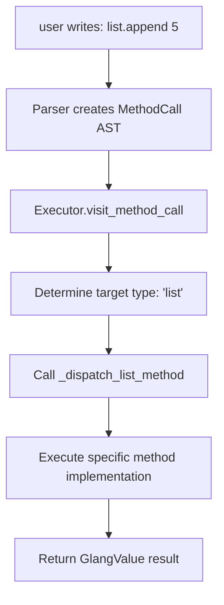

# Glang Architecture: Graph-Based Computing

## Overview

Glang implements a radical architecture where **graphs are the fundamental abstraction at every level**. This document describes how this philosophy is realized in the codebase.

## Core Components

### 1. Graph Infrastructure (`src/glang/core/`)

#### Base Classes
- **`Node`** - Graph nodes with unique IDs, data storage, and edge management
- **`Edge`** - Directed connections with optional weights and metadata  
- **`Graph`** - Container managing nodes and edges with traversal methods
- **`GraphType`** - Extensible enumeration for different graph behaviors

#### Key Design Decisions
- **Unique IDs**: Every node has a UUID for identity and equality
- **Metadata Support**: Edges can carry arbitrary metadata for extensibility
- **Type System**: GraphType allows specialized behavior while maintaining unified APIs
- **Memory Management**: Nodes automatically register/deregister edges

### 2. Linear Graph Operations (`Graph` class)

Lists are implemented as **linear directed graphs**:
```
[A, B, C] = Node(A) -> Node(B) -> Node(C)
```

Operations maintain both graph structure and list semantics:
- `append()` - Creates new node and edge from tail
- `insert()` - Rewires edges to include new node
- `delete()` - Removes node and reconnects edges  
- `traverse()` - Follows edge pointers from head to tail

### 3. Variable Meta-Graph (`src/glang/core/variable_graph.py`)

The revolutionary aspect: **variable storage itself is a graph**.

#### VariableGraph Structure
```
📛 "fruits" --assignment--> 📊 LinearGraph([apple, banana])
📛 "numbers" --assignment--> 📊 LinearGraph([1, 2, 3])
```

#### Implementation Details
- **Name nodes** (`VariableNode`) store variable names as data
- **Value nodes** (`VariableNode`) store Graph objects as data  
- **Assignment edges** connect names to current values with metadata
- **Reassignment** removes old edges and creates new ones
- **Introspection** methods expose the meta-graph structure

### 4. REPL Integration (`src/glang/repl/`)

#### GraphManager
- Uses `VariableGraph` instead of traditional hash table
- All variable operations work through graph methods
- Provides meta-graph visualization and statistics

#### REPL Commands
- **Data level**: `show`, `traverse`, `append`, etc.
- **Meta level**: `namespace`, `stats`, `info`
- **Unified**: Same graph concepts apply to both levels

## Architectural Benefits

### 1. Conceptual Consistency
No cognitive overhead switching between "data structures" and "variables":
```bash
glang> show fruits        # Data graph visualization
glang> namespace          # Meta-graph visualization  
glang> stats              # Statistics work on both levels
```

### 2. Natural Introspection
Since everything is a graph, everything can be examined:
```bash
Variable Namespace Graph:
  Variables: 2
  Total nodes: 4
  Assignment edges: 2
  📛 fruits -> 📊 linear graph (3 nodes)
  📛 numbers -> 📊 linear graph (5 nodes)
```

### 3. Composability
Graph operations work consistently:
- Data graphs can be merged, split, transformed
- Meta-graphs can be analyzed, visualized, modified
- Future: Cross-graph references, dependencies, queries

### 4. Extensibility Foundation
The architecture naturally supports:
- **Tree graphs** with parent-child constraints
- **Weighted graphs** for pathfinding and optimization
- **Cyclic graphs** for state machines and workflows
- **Graph databases** for complex queries
- **Module systems** as connected subgraphs

## Implementation Patterns

### Graph-Native Development
When adding features, follow these patterns:

#### 1. Identify Entities and Relationships
```python
# Don't think: "I need a list of functions"
functions = []

# Think: "I need nodes for functions with call edges"
function_graph = Graph(GraphType.DIRECTED)
main_func = function_graph.create_node(FunctionDef("main"))
helper_func = function_graph.create_node(FunctionDef("helper"))
function_graph.add_edge(main_func, helper_func, metadata={"call_type": "direct"})
```

#### 2. Provide Introspection
Every graph structure should be examinable:
```python
def get_function_info(self) -> str:
    return f"Functions: {len(self.nodes)}, Calls: {len(self.edges)}"

def visualize_call_graph(self) -> str:
    return render_graph(self.function_graph)
```

#### 3. Maintain Graph Properties  
Operations should preserve graph invariants:
```python
def add_function(self, func_def):
    # Create node
    func_node = self.function_graph.create_node(func_def)
    
    # Update call edges based on function body
    for call in func_def.calls:
        target = self.find_function_node(call.name)
        if target:
            self.function_graph.add_edge(func_node, target)
```

## Testing Strategy

### Dual-Level Testing
Tests verify both functional behavior AND graph structure:

```python
def test_variable_assignment():
    var_graph = VariableGraph()
    test_data = Graph.from_list([1, 2, 3])
    
    # Test functional behavior
    var_graph.assign_variable("test", test_data)
    assert var_graph.get_variable("test") is test_data
    
    # Test graph structure  
    assert var_graph.size == 2  # name node + value node
    assert var_graph.edge_count == 1  # assignment edge
    
    assignment_edges = [e for e in var_graph.edges if e.get_metadata("assignment")]
    assert len(assignment_edges) == 1
    assert assignment_edges[0].get_metadata("variable_name") == "test"
```

## Future Architecture

### Phase 2: Function Graphs
```python
# Functions as graph nodes with parameter/return edges
func_graph = Graph(GraphType.DIRECTED)
add_func = func_graph.create_node(FunctionDef("add", params=["a", "b"], returns="sum"))

# Function calls as edge traversals
call_graph.add_edge(main_node, add_func, metadata={"args": [1, 2]})
```

### Phase 3: Module Graphs  
```python
# Modules as subgraphs with import/export edges
module_graph = Graph(GraphType.DIRECTED)
math_module = module_graph.create_node(ModuleGraph("math"))
main_module = module_graph.create_node(ModuleGraph("main"))
module_graph.add_edge(main_module, math_module, metadata={"import": "add"})
```

### Phase 4: Distributed Graphs
```python
# Network programming as graph partitioning
distributed_graph = Graph(GraphType.WEIGHTED)
node_a = distributed_graph.create_node(ServerNode("192.168.1.1"))  
node_b = distributed_graph.create_node(ServerNode("192.168.1.2"))
distributed_graph.add_edge(node_a, node_b, weight=network_latency)
```

## Method Dispatch Architecture

### Design Decision: Functional Dispatch vs Object-Oriented Methods

One of Glang's key architectural decisions is **how type-specific methods are implemented**. This deserves documentation because it differs from typical Python patterns.

#### The Problem

When a user writes `list.append(5)` or `string.upper()`, how should the language implement these type-specific operations?

#### Options Considered

**Option 1: Traditional Object-Oriented Methods**
```python
class ListValue(GlangValue):
    def append(self, item):
        # Implementation here
        pass
    
    def sort(self):
        # Implementation here  
        pass

class StringValue(GlangValue):
    def upper(self):
        # Implementation here
        pass
```

**Option 2: Functional Method Dispatch** ⭐ **(Chosen)**
```python
class ASTExecutor:
    def _dispatch_list_method(self, method_name, target, args):
        if method_name == "append":
            # Implementation here
        elif method_name == "sort":
            # Implementation here
    
    def _dispatch_string_method(self, method_name, target, args):
        if method_name == "upper":
            # Implementation here
```

#### Decision: Functional Dispatch

Glang uses **functional method dispatch** where:

1. **Parser** creates generic `MethodCall` AST nodes for all method calls
2. **Executor** determines target type at runtime
3. **Type-specific dispatch functions** handle the actual method implementation
4. **Universal methods** are handled uniformly across all types

#### Architectural Rationale

**1. Alignment with Functional Programming Principles**
- Glang leans toward functional programming (immutable transformations, graph operations)
- Separating data (values) from operations (methods) follows functional philosophy
- Data and behaviors are distinct concerns

**2. Language Extension Simplicity**
```python
# Adding new methods doesn't require class modification
def _dispatch_list_method(self, method_name, target, args):
    # ... existing methods ...
    elif method_name == "new_method":  # Easy to add!
        return self._handle_new_list_method(target, args)
```

**3. Consistent Universal Method Handling**
Universal methods like `type()`, `size()`, `methods()` work uniformly:
```python
def _apply_universal_method(self, method_name, target):
    if method_name == "type":
        return StringValue(target.get_type())  # Works for ANY GlangValue
    elif method_name == "size":
        return NumberValue(target.size())      # Consistent across all types
```

**4. Simpler Runtime Model**
- No method lookup overhead or vtable construction
- No inheritance chains to navigate
- Direct dispatch based on known type and method name
- Predictable execution path

**5. Better Error Handling**
```python
# Easy to provide specific error messages
if method_name not in valid_methods[target_type]:
    available = ", ".join(sorted(valid_methods[target_type]))
    raise RuntimeError(f"Method '{method_name}' not available on {target_type}. Available: {available}")
```

#### Implementation Flow



#### Trade-offs Analysis

**Functional Dispatch ✅ (Chosen)**
- ✅ Simple, predictable execution model
- ✅ Easy to add new methods without touching existing classes  
- ✅ Clean separation between data and operations
- ✅ Consistent universal method handling
- ✅ Better alignment with functional programming paradigms
- ❌ Method implementations spread across executor rather than co-located with types
- ❌ Some code duplication for similar operations across types
- ❌ Large dispatch functions can become unwieldy

**Object-Oriented Methods ❌ (Rejected)**
- ✅ Methods co-located with their types
- ✅ Natural inheritance for shared behavior  
- ✅ More familiar to Python developers
- ✅ Could enable polymorphism
- ❌ More complex runtime with method resolution
- ❌ Harder to implement universal methods consistently  
- ❌ Less aligned with functional language design
- ❌ Class hierarchy could become complex

#### Why This Choice Aligns with Glang's Philosophy

This decision reflects Glang's broader architectural principles:

1. **Graph-Native Design**: Values are graph nodes with data; operations are external transformations
2. **Functional Approach**: Data and operations are separate concerns
3. **Consistent Execution**: Uniform handling across all types supports the "everything is a graph" philosophy
4. **Language Simplicity**: Users see consistent `value.method()` syntax regardless of implementation complexity

#### Future Considerations

This architecture supports planned features:

- **New data types**: Easy to add dispatch functions for graph types, tree types, etc.
- **Method aliases**: Can map multiple method names to same implementation
- **Performance optimization**: Hot methods can be optimized without changing class hierarchies
- **Debugging support**: Execution flow is explicit and traceable

---

## Summary

Glang's architecture demonstrates that "everything is a graph" is not just a slogan - it's a practical, implementable approach that:

1. **Unifies** data structures and meta-structures under one abstraction
2. **Enables** powerful introspection and debugging capabilities  
3. **Simplifies** the mental model for developers
4. **Provides** a solid foundation for advanced features
5. **Supports** functional programming principles through architectural decisions like method dispatch

The result is a language where the core abstraction is so fundamental that it changes how we think about programming itself.